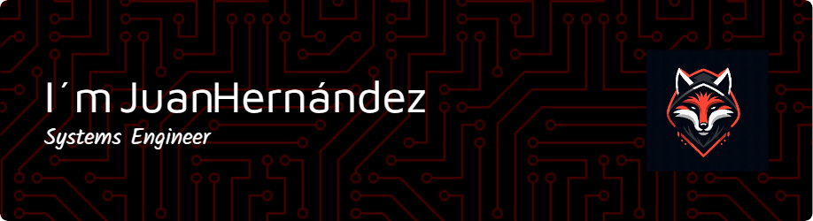

#  𝑯𝒊 𝑻𝒉𝒆𝒓𝒆, 𝑾𝒆𝒍𝒄𝒐𝒎𝒆 𝑻𝒐 𝑴𝒚 𝑮𝒊𝒕𝑯𝒖𝒃

### Skills

    <a href="https://www.mysql.com/" target="_blank" rel="noreferrer">     

<!--
**HernzDev/HernzDev** is a ✨ _special_ ✨ repository because its `README.md` (this file) appears on your GitHub profile.

Here are some ideas to get you started:

- 🔭 I’m currently working on ...
- 🌱 I’m currently learning ...
- 👯 I’m looking to collaborate on ...
- 🤔 I’m looking for help with ...
- 💬 Ask me about ...
- 📫 How to reach me: ...
- 😄 Pronouns: ...
- ⚡ Fun fact: ...
-->
